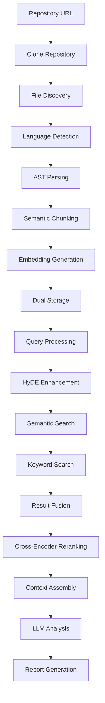

# fuGPT: AI-Powered Code Analysis Tool (AST-Enhanced)

A powerful tool for automated code analysis using Retrieval-Augmented Generation (RAG) with LLMs, enhanced with Abstract Syntax Tree (AST)-based chunking for precise and contextually relevant code analysis.

## Key Features

- **AST-Based Semantic Chunking**: Extracts complete semantic units (functions, classes, methods) rather than arbitrary text fragments
- **Advanced Retrieval Pipeline**: Hybrid search combining semantic embeddings, keyword search (BM25), and cross-encoder reranking
- **Multi-Language Support**: Python, JavaScript, Java, C++ with extensible architecture
- **HyDE Enhancement**: Optional Hypothetical Document Embeddings for improved query understanding
- **Comprehensive Analysis**: Expert-level code evaluation with detailed reports

## Modern Development Environment

- **uv-based dependency management**: Fast, modern Python package management
- **Professional linting**: Ruff, Black, isort, MyPy, Bandit
- **Pre-commit hooks**: Automated code quality checks
- **Testing framework**: pytest with comprehensive test structure
- **Development scripts**: Automated formatting, linting, and testing

## Installation

### Prerequisites

- Python 3.9+
- OpenAI API key for embeddings
- Git for repository cloning

### Quick Setup

```bash
# Clone the repository
git clone https://github.com/jamesfishwick/fuGPT.git
cd fuGPT

# Setup development environment (installs all dependencies)
./scripts/setup.sh

# Or manually with uv
uv sync --extra dev
```

### Manual Installation

1. **Install core dependencies**:

   ```bash
   uv sync
   ```

2. **Install development dependencies** (optional):

   ```bash
   uv sync --extra dev
   ```

3. **Configure OpenAI API** (required for embeddings):
   ```bash
   export OPENAI_API_KEY="your-api-key-here"
   ```

## Usage

### Quick Start

```bash
# Vectorize a repository
uv run python vectorize-repo.py

# Analyze the vectorized repository
uv run python analyze-repo.py
```

### Development Workflow

```bash
# Complete development workflow
make dev              # Format, lint, test, pre-commit

# Individual operations
make format          # Auto-format code
make lint            # Run all linting
make test            # Run tests
make clean           # Clean build artifacts
```

## How It Works: AST-Enhanced Code Analysis

### 1. AST-Based Semantic Chunking

Instead of naive text splitting, fuGPT uses **tree-sitter** to parse code into its Abstract Syntax Tree and extract complete semantic units:

```python
# Language-specific AST node targeting
CHUNK_TARGET_NODE_TYPES = {
    "python": ["function_definition", "class_definition"],
    "javascript": ["function_declaration", "class_declaration", "method_definition"],
    "java": ["method_declaration", "class_declaration", "constructor_declaration"],
    "cpp": ["function_definition", "class_specifier", "constructor_definition"],
}
```

#### Why AST-Based Chunking is Superior

**Naive Text Splitting:**

```python
# Chunk 1: "def calculate_score(user_data, weights):\n    \"\"\"Calculate weighted"
# Chunk 2: "user score based on factors.\"\"\"\n    if not user_data:"
# Chunk 3: "return 0\n    score = 0\n    for factor, weight in"
```

**AST-Based Chunking:**

```python
# Chunk 1: Complete function with all context
def calculate_score(user_data, weights):
    \"\"\"Calculate weighted user score based on multiple factors.\"\"\"
    if not user_data or not weights:
        return 0

    score = 0
    for factor, weight in weights.items():
        if factor in user_data:
            score += user_data[factor] * weight

    return min(score, 100)
```

#### Precise Boundary Detection

Tree-sitter provides **exact byte-level positioning** for each semantic unit:

```python
chunk_metadata = {
    "code": code_content[node.start_byte:node.end_byte],
    "start_line": node.start_point[0] + 1,
    "end_line": node.end_point[0] + 1,
    "node_type": node.type,  # "function_definition", "class_definition", etc.
    "language": "python",
    "file_path": "src/utils.py"
}
```

### 2. Dual Storage Architecture

**SQLite Database**: Rich metadata storage

```sql
CREATE TABLE chunks (
    id TEXT PRIMARY KEY,           -- "filepath:start_byte:end_byte"
    file_path TEXT,               -- "src/utils.py"
    language TEXT,                -- "python"
    node_type TEXT,               -- "function_definition"
    start_line INTEGER,           -- 45
    end_line INTEGER,             -- 67
    start_byte INTEGER,           -- 1234
    end_byte INTEGER,             -- 1890
    code TEXT,                    -- Full function/class code
    embedding_id INTEGER          -- Link to vector index
);
```

**HNSWlib Index**: Fast vector similarity search

```python
# Approximate nearest neighbor search
hnsw_index = hnswlib.Index(space='cosine', dim=1536)
labels, distances = hnsw_index.knn_query(query_embedding, k=15)
```

### 3. Advanced Hybrid Retrieval Pipeline

#### Step 1: HyDE (Hypothetical Document Embeddings)

```python
# Generate hypothetical code to bridge query-code gap
hyde_prompt = f"Write ideal code that would answer: {query}"
hypothetical_code = llm_generate(hyde_prompt)
enhanced_query_embedding = embed_model.embed(hypothetical_code)
```

#### Step 2: Semantic Search

```python
# Find semantically similar code chunks
semantic_results = hnsw_index.knn_query(query_embedding, k=15)
```

#### Step 3: Keyword Search (BM25)

```python
# Traditional keyword-based search
tokenized_query = query.lower().split()
bm25_scores = bm25_index.get_scores(tokenized_query)
```

#### Step 4: Result Fusion

```python
# Combine and deduplicate results
combined_results = merge_and_deduplicate(semantic_results, bm25_results)
```

#### Step 5: Cross-Encoder Reranking

```python
# Precise relevance scoring
reranker = CrossEncoder("cross-encoder/ms-marco-MiniLM-L-6-v2")
rerank_pairs = [[query, chunk["code"]] for chunk in candidates]
final_scores = reranker.predict(rerank_pairs)
```

### 4. Complete Analysis Workflow



## Project Structure

```
fuGPT/
├── README.md                  # This comprehensive guide
├── pyproject.toml             # Modern Python project configuration
├── Makefile                   # Development automation
├──
├── Core Scripts
│   ├── vectorize-repo.py         # AST-based repository vectorization
│   └── analyze-repo.py           # Advanced code analysis with hybrid retrieval
├──
├── Configuration
│   ├── system-prompt.txt         # LLM system prompt
│   ├── questions.txt             # Code evaluation criteria
│   └── .pre-commit-config.yaml  # Pre-commit hooks
├──
├── Testing
│   └── tests/
│       ├── __init__.py
│       └── test_imports.py       # Basic import and syntax tests
├──
├── Development Scripts
│   └── scripts/
│       ├── setup.sh              # Development environment setup
│       ├── format.sh             # Code formatting
│       ├── lint.sh               # Code linting
│       ├── test.sh               # Test execution
│       └── dev.sh                # Complete development workflow
└──
└── Generated Files
    ├── repo-embeddings.db        # SQLite database (chunk metadata)
    ├── repo-embeddings.hnsw      # HNSWlib index (embeddings)
    ├── final_code_evaluation.md  # Analysis report
    └── answer_*.md               # Individual question answers
```

## Key Advantages

### 1. Semantic Completeness

- **Complete logical units**: Functions, classes, methods extracted as whole entities
- **Maintained context**: All related code (docstrings, logic, return statements) kept together
- **Language-aware processing**: Different parsers for different programming languages

### 2. Precise Retrieval

- **Hybrid search**: Combines semantic similarity with keyword matching
- **Advanced reranking**: Cross-encoder provides fine-grained relevance scoring
- **HyDE enhancement**: Bridges the gap between natural language queries and code

### 3. Scalability

- **Fast similarity search**: HNSWlib provides approximate nearest neighbor search
- **Efficient metadata queries**: SQLite enables complex filtering and sorting
- **Optimized chunking**: Reduces embedding dimensionality vs. full-file embeddings

### 4. Multi-Language Support

- **Extensible architecture**: Easy to add new programming languages
- **Syntax-aware chunking**: Respects language-specific constructs
- **Unified interface**: Same analysis pipeline for all languages

## Development

### Code Quality

```bash
# Auto-format code
make format

# Run linting
make lint

# Run tests
make test

# Complete development workflow
make dev
```

### Available Tools

- **Ruff**: Fast Python linter (replaces flake8, pylint)
- **Black**: Opinionated code formatter
- **isort**: Import sorting
- **MyPy**: Static type checking
- **Bandit**: Security linter
- **Pre-commit**: Automated git hooks

### Adding New Languages

1. **Install tree-sitter grammar**:

   ```bash
   uv add tree-sitter-rust  # Example for Rust
   ```

2. **Update language configuration**:

   ```python
   # In vectorize-repo.py
   CHUNK_TARGET_NODE_TYPES["rust"] = ["function_item", "impl_item", "struct_item"]

   # In initialize_grammars()
   import tree_sitter_rust
   LANGUAGE_GRAMMARS[".rs"] = (Language(tree_sitter_rust.language()), "rust")
   ```

## Configuration

### Embedding Models

```python
# In vectorize-repo.py and analyze-repo.py
QUERY_EMBED_MODEL_ID = "text-embedding-3-small"  # OpenAI
# QUERY_EMBED_MODEL_ID = "jina-embeddings-v2-base-en"  # Alternative
```

### Retrieval Parameters

```python
# In analyze-repo.py
SEMANTIC_SEARCH_TOP_K = 15    # Results from semantic search
BM25_TOP_K = 15               # Results from keyword search
RERANKER_TOP_K = 5            # Final chunks for LLM context
USE_HYDE = True               # Enable/disable HyDE
```

### Customization Files

- **`questions.txt`**: Modify evaluation criteria
- **`system-prompt.txt`**: Change LLM analysis approach
- **`pyproject.toml`**: Update dependencies and tool configurations

## Contributing

We welcome contributions! Please see our development setup:

```bash
# Setup development environment
./scripts/setup.sh

# Make changes and test
make dev

# Commit with pre-commit hooks
git commit -m "Your changes"
```

## License

[Insert license information here]

## Support

For issues, questions, or contributions:

- Create an issue on GitHub
- Join our discussions
- Submit pull requests

---

**fuGPT** represents a significant advancement in automated code analysis, combining the precision of AST-based parsing with the power of modern language models for comprehensive, context-aware code evaluation.
